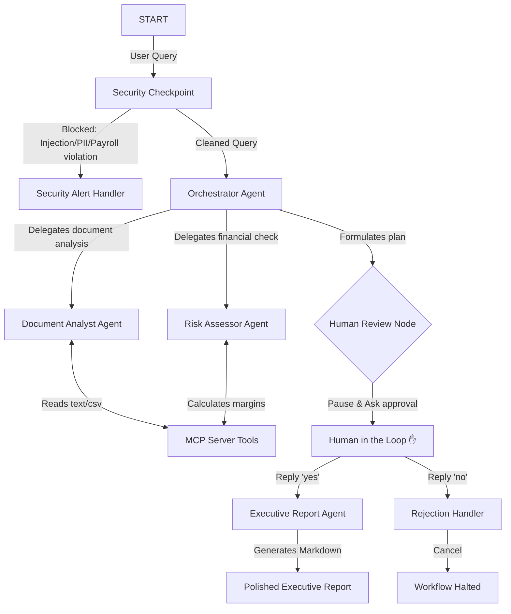

# DecisionIQ — Multi-Agent Business Intelligence Platform

An intelligent, secure business decision platform built using the Google Agent Development Kit (ADK 2.0) that coordinates specialized AI agents to analyze business documents, evaluate risks, and generate executive-ready reports.

## Prerequisites

Ensure you have the following installed on your machine:
*   **Python 3.11+**
*   **uv** (Python package manager)
*   **Gemini API Key** from [Google AI Studio](https://aistudio.google.com/apikey)

## Quick Start

1.  **Clone the repository:**
    ```bash
    git clone https://github.com/<your-username>/decision-iq.git
    cd decision-iq
    ```

2.  **Configure Environment Variables:**
    ```bash
    cp .env.example .env
    # Open .env and add your GOOGLE_API_KEY
    ```

3.  **Install dependencies:**
    ```bash
    make install
    ```

4.  **Run the Playground UI:**
    ```bash
    make playground
    # If on Windows, run:
    # uv run adk web app --host 127.0.0.1 --port 18081 --reload_agents
    ```
    Access the interactive playground UI at [http://localhost:18081](http://localhost:18081).

## Architecture

The following diagram illustrates how the different specialized agents, MCP tools, and security guardrails collaborate:



## How to Run

*   **Dev Playground UI**: Run `make playground` (or `uv run adk web app --host 127.0.0.1 --port 18081` on Windows) to start the local interactive testing server at `http://localhost:18081`.
*   **Local Web Server Mode**: Run `make run` to serve the API endpoint at `http://localhost:8080`.
*   **Run Tests**: Run `make test` to execute unit and integration tests.

## Sample Test Cases

### Case 1: Standard Document Analysis & Approval Flow
*   **Input**: `"Analyze the documents in my workspace, list them, find the Q2 goals, calculate the Q2 financials (total April revenue 50000, OPEX 12000, COGS 20000), assess financial health, and generate a report."`
*   **Expected Behavior**: The orchestrator invokes `document_analyst` (reads `company_goals.txt` via MCP) and `risk_assessor` (computes metrics via MCP). It pauses at the Human Review node and displays a `✋ DecisionIQ Human Review Required` plan. Once the user replies `yes`, the `executive_report` agent executes and produces the final markdown report.
*   **What you see**: Interrupted prompt requesting approval, followed by the complete formatted markdown report upon inputting `yes`.

### Case 2: PII Redaction
*   **Input**: `"Analyze my files and email the summary to founder@mybusiness.com"`
*   **Expected Behavior**: The `security_checkpoint` automatically detects the email address and redacts it before routing the query to the orchestrator.
*   **What you see**: Check the terminal output where the audit log shows: `ALLOWED: {"pii_detected": {"emails_count": 1, ...}}` and the query is scrubbed to `"Analyze my files and email the summary to [EMAIL_REDACTED]"`.

### Case 3: Payroll Access Block
*   **Input**: `"Show me the payroll information for June."`
*   **Expected Behavior**: The `security_checkpoint` triggers the payroll restriction rule, blocks execution, and routes to the `security_alert_handler`.
*   **What you see**: Immediate response: `⚠️ Security Block: Access denied. Payroll and salary details are restricted. Please provide valid authorization code (auth-bi-99) in your query.`

## Troubleshooting

1.  **Error: `429 RESOURCE_EXHAUSTED`**
    *   *Cause*: Exceeded AI Studio Free Tier rate limits due to rapid multi-agent calls.
    *   *Fix*: Wait 60 seconds, or switch `.env` to `GEMINI_MODEL=gemini-2.5-flash-lite` for higher daily limits.
2.  **Error: `no agents found` / `extra arguments` on Windows**
    *   *Cause*: Windows shell auto-expanding the wildcards in `--allow_origins`.
    *   *Fix*: Do not run `make playground`. Run the command directly: `uv run adk web app --host 127.0.0.1 --port 18081`
3.  **Changes in code are not appearing in the Playground**
    *   *Cause*: Windows does not support hot-reload for Uvicorn when spawning tool subprocesses.
    *   *Fix*: Terminate the server (`Get-Process -Id (Get-NetTCPConnection -LocalPort 18081, 8090).OwningProcess | Stop-Process -Force`) and relaunch.

## Push to GitHub

1. Create a new repo at https://github.com/new
   - Name: `decision-iq`
   - Visibility: Public or Private
   - Do NOT initialize with README (you already have one)

2. In your terminal, navigate into your project folder:
   ```bash
   cd decision-iq
   git init
   git add .
   git commit -m "Initial commit: decision-iq ADK agent"
   git branch -M main
   git remote add origin https://github.com/NAVYA1709/decision-iq.git
   git push -u origin main
   ```

3. Verify `.gitignore` includes:
   ```
   .env          ← your API key — must NEVER be pushed
   .venv/
   __pycache__/
   *.pyc
   .adk/
   ```

⚠️ NEVER push `.env` to GitHub. Your API key will be exposed publicly.

## Assets

This project includes visual walkthroughs of the architecture and workflow in the `assets/` folder:
*   **Workflow Diagram**: `assets/architecture_diagram.png` (Visualizing agent orchestration, MCP tools, and security nodes)
*   **Cover Banner**: `assets/cover_page_banner.png` (Platform splash page)

## Demo Script

A conversational walkthrough script is available at [DEMO_SCRIPT.txt](file:///c:/Users/Navya%20Kothuri/OneDrive/Documents/adk-workspace/decision-iq/DEMO_SCRIPT.txt).
