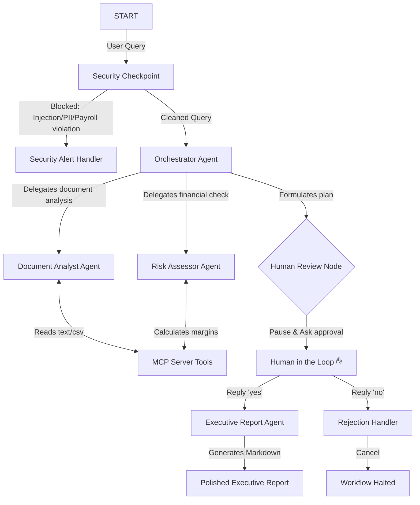

# DecisionIQ — Hackathon Submission Write-Up

## Problem Statement

In today's fast-paced business environment, decision-makers are inundated with huge volumes of weekly operational documents, including text files, spreadsheets, CSV files, and PDFs. Manually reading, aggregating, analyzing financial data, and identifying business risks from these files consumes crucial hours, delaying time-sensitive strategic decisions.

**DecisionIQ** addresses this bottleneck by offering an autonomous, multi-agent business intelligence platform. Users can simply upload business documents and ask natural language questions. Multiple specialized agents then collaborate in a secure workflow to ingest files, analyze data trends, compute metrics, flag operational risks, and draft professional, executive-ready reports.

---

## Solution Architecture

The DecisionIQ platform is designed around a secure, human-in-the-loop multi-agent graph:

---

## Concepts Used

*   **ADK Workflow Graph API**: Coordinates the execution flow deterministically via nodes and edges defined in [app/agent.py](file:///c:/Users/Navya%20Kothuri/OneDrive/Documents/adk-workspace/decision-iq/app/agent.py#L241-L260).
*   **LlmAgent**: Powers specialized sub-agents (`document_analyst`, `risk_assessor`, `orchestrator`, and `executive_report`) using Gemini models configured in [app/agent.py](file:///c:/Users/Navya%20Kothuri/OneDrive/Documents/adk-workspace/decision-iq/app/agent.py#L70-L126).
*   **AgentTool**: Utilized by the `orchestrator` to delegate analysis and risk tasks to specialized agents (defined in [app/agent.py](file:///c:/Users/Navya%20Kothuri/OneDrive/Documents/adk-workspace/decision-iq/app/agent.py#L105)).
*   **MCP Server (Model Context Protocol)**: Exposes workspace document listing, file reading, and financial calculations to LLM agents as standard tools in [app/mcp_server.py](file:///c:/Users/Navya%20Kothuri/OneDrive/Documents/adk-workspace/decision-iq/app/mcp_server.py).
*   **Security Checkpoint**: The `security_checkpoint` node sits at the entry point of the graph in [app/agent.py](file:///c:/Users/Navya%20Kothuri/OneDrive/Documents/adk-workspace/decision-iq/app/agent.py#L132-L200) to scrub PII, block prompt injection, and enforce business data-access boundaries.
*   **Agents CLI**: Scaffolded, dependencies managed via `uv`, and tested locally via `agents-cli playground` configurations.

---

## Security Design

1.  **PII Scrubbing**: Using regular expressions, standard email addresses and credit card numbers are scrubbed to `[EMAIL_REDACTED]` and `[CREDIT_CARD_REDACTED]` before hitting the LLM model endpoints. This prevents sensitive data leakage.
2.  **Prompt Injection Safeguard**: Scans user input for malicious keywords (like `ignore previous instructions`, `bypass safeguards`). Queries containing these are immediately blocked and routed to the `security_alert_handler` node.
3.  **Domain-Specific Access Boundary**: Restricts access to sensitive topics such as `payroll` and `salary` unless a correct security bypass token (`auth-bi-99`) is explicitly present in the query.
4.  **Audit Logs**: Outputs structured JSON records for every query evaluated, tracking detected PII counts, injection results, and security decisions.

---

## MCP Server Design

Our custom Model Context Protocol server (written using FastMCP in [app/mcp_server.py](file:///c:/Users/Navya%20Kothuri/OneDrive/Documents/adk-workspace/decision-iq/app/mcp_server.py)) provides standard tools:
*   `list_workspace_documents()`: Lists available TXT, CSV, PDF, and DOCX files in the workspace (excluding `.venv` and system files) so the analyst knows what to read.
*   `read_business_document(file_path)`: Reads up to 4000 characters from target CSV/TXT files safely (checking workspace directory paths to prevent path traversal attacks).
*   `calculate_financial_metrics(revenue, operating_expenses, cost_of_goods_sold)`: Performs raw mathematical calculations of gross profit, operating income, gross/operating margin percentages, and assesses financial health.

---

## Human-in-the-Loop (HITL) Flow

A key principle in business applications is keeping a human in control. In DecisionIQ, we implemented this using the ADK 2.0 `RequestInput` mechanism. 

After the Orchestrator receives analyses from both sub-agents, it aggregates the findings and formats an **Analysis Plan**. The workflow then transitions to the `human_review` node, which halts execution, yields a `RequestInput` event, and waits for the manager to approve the plan.
*   If the user replies **`yes`**, the plan is approved, routing the execution to the `executive_report` agent.
*   If the user replies **`no`**, the workflow halts safely via the `rejection_handler` without wasting tokens or drafting unwanted reports.

---

## Demo Walkthrough

1.  **Test Case 1: End-to-End Report Generation**
    *   *Input*: `"Analyze the documents in my workspace, find Q2 goals, calculate the Q2 financials (total April revenue 50000, OPEX 12000, COGS 20000), and generate a report."*
    *   *Result*: Orchestrator plans, Document Analyst reads the goals, Risk Assessor calculates metrics. The system pauses for approval: `Would you like to proceed with generating the final report?`. Upon answering `yes`, it outputs a beautifully compiled markdown report.
2.  **Test Case 2: PII Redaction**
    *   *Input*: `"Summarize my files and send it to test-user@domain.com."`
    *   *Result*: Check terminal/logs. The email address is redacted as `[EMAIL_REDACTED]`, and the log records a PII scrub event.
3.  **Test Case 3: Security Restriction**
    *   *Input*: `"Show me payroll files for June."*
    *   *Result*: Immediately blocked. Response shows: `⚠️ Security Block: Access denied. Payroll and salary details are restricted...`

---

## Impact / Value Statement

DecisionIQ saves startups, founders, and operation leads hours of manual synthesis work. By combining secure, automated file ingestion and mathematical calculations with structured LLM summarization, decision-makers receive accurate, risk-aware business intelligence reports on-demand while ensuring company compliance, PII security, and financial boundaries are maintained.
